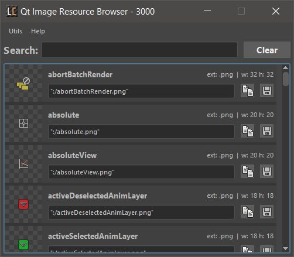

# Maya Qt Image Resource Browser


## Description

This Python tool for Maya will let you browse all the image resources Maya has already loaded from QResource bundles.

These internal resources make it easy to add images to buttons and other UI elements without authoring or packaging images in your tools and scripts.

There is the added benefit of having your application look native to Maya and feel familiar with users.

This is an example of using a built in Maya icon as a QPixmap in your code:

```python
px_open = QtGui.QPixmap(":/fileOpen.png")
```

##### Screenshot


## Installation and Use
1. Place the entire directory `qt_img_resource_browser` in your Maya scripts directory or a directory that Maya can load Python scripts from.
    
    ```
    ├- maya
       ├- scripts
          ├- qt_img_resource_browser
             ├- app.py
             ├- interface.py
             ├- etc . . .
    ```
    
2. Restart Maya.
3. Launch the window with this python command:

    ```python
    # Python
    import qt_img_resource_browser.interface as interface
    interface.load()
    ```

##### UI

* Add a shortcut to the shelf from the "Utils" main menu.
* Open the Github page from the "Help" main menu.
* The number of images in the list is displayed in the title bar.

##### Details


1. A preview of the image
2. The path for the image
3. The extension of the image
4. The pixel dimensions of the image
5. Copy the path with quotes to the clipboard
6. Save the image file as a .png

##### Notes    

By default some paths are excluded from the list. You can edit the `config.json` file to modify these exclusions.

This tool uses the [Qt.py](https://github.com/mottosso/Qt.py) shim to enable compatibility with PySide or PySide2.

I can only test on Windows 10 at the moment. I won't be able to reproduce any issues running on another platform.

Please note that some images included in later versions of Maya may not be present in earlier versions.

## Known Issues

* Loading the window is slow initially due to thousands of widgets.